# e-Khadi

**Community Credit & Stokvel Platform for South African Spaza Shops**

e-Khadi is a community credit and stokvel platform for SASSA grant recipients, built for the Huawei Code4Mzansi 2025 competition.

This repository contains two implementations:

- **Current submission app (active):** Next.js web application in `web/` (deployed live)
- **Legacy implementation (reference):** Shopware 6 plugin in `src/`

---

## Huawei Cloud Architecture

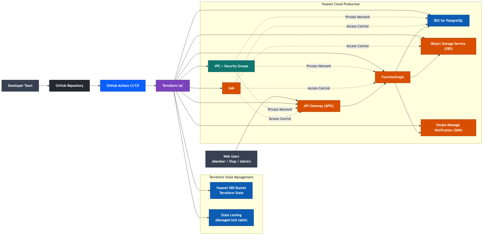

The current web app is live on Vercel for demo access, while the target competition architecture is designed for Huawei Cloud production.

### Target Architecture (Huawei)

- **Frontend:** Next.js web client (member, shop, admin portals)
- **Ingress Layer:** **API Gateway (APIG)** for secured API entry, throttling, and routing
- **Application Layer:** **FunctionGraph** for serverless business logic (credit scoring, approvals, repayments)
- **Data Layer:** **RDS for PostgreSQL** for transactional records (members, groups, credit, repayments)
- **File/Asset Storage:** **Object Storage Service (OBS)** for exports, proof documents, and media assets
- **Notifications:** **Simple Message Notification (SMN)** for repayment reminders, approvals, and alerts
- **Network & Security:** **VPC + Security Groups + IAM** for private networking and role-based access

### Core Request Flow

1. User logs in and performs an action in the web app.
2. Request enters Huawei **APIG**.
3. **FunctionGraph** validates rules and executes business logic.
4. Function reads/writes data in **RDS PostgreSQL**.
5. Supporting files are stored/retrieved from **OBS**.
6. Events (approval, due repayment, status changes) trigger **SMN** notifications.

### Why This Architecture

- Scales with low operational overhead using serverless compute
- Keeps sensitive financial data in managed relational storage
- Supports strong auditability for compliance and judging criteria
- Aligns directly with Huawei developer competition cloud service expectations

---

## App Screenshots

Updated: 17 March 2026 (captured from the live deployment)

<p align="center">
  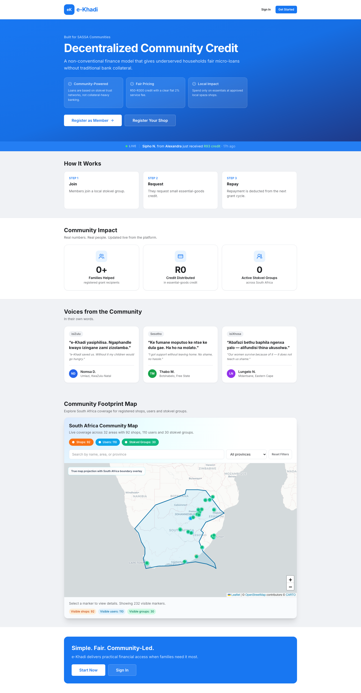
  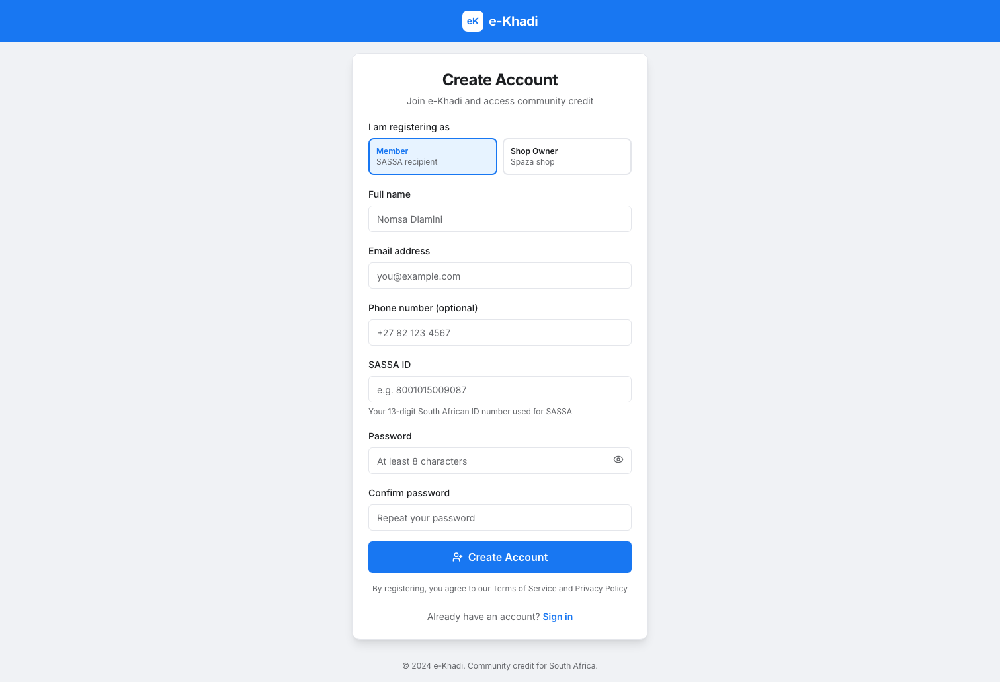
  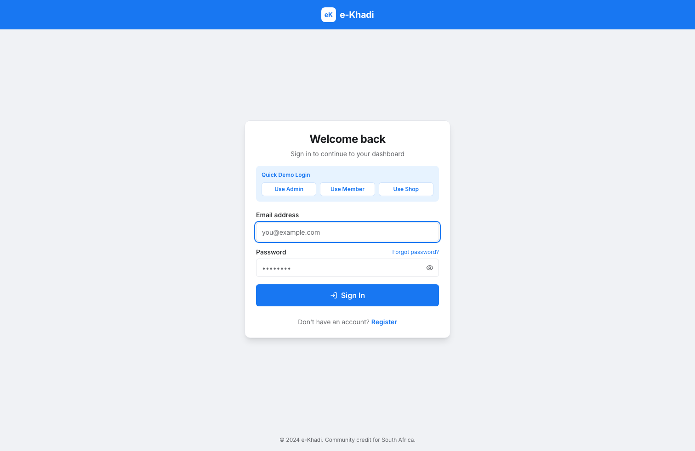
</p>
<p align="center">
  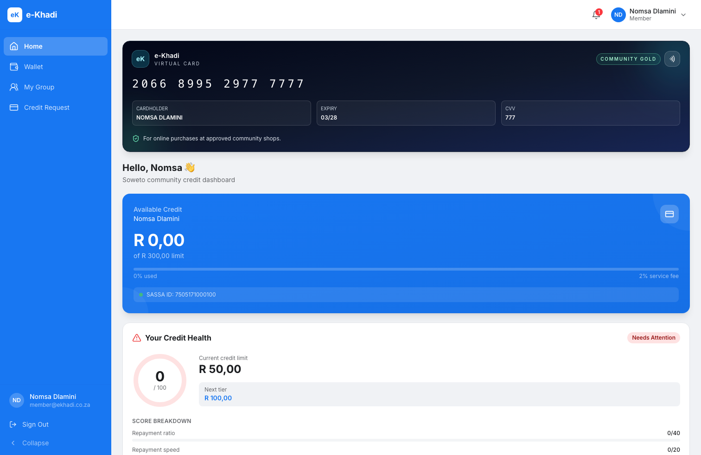
  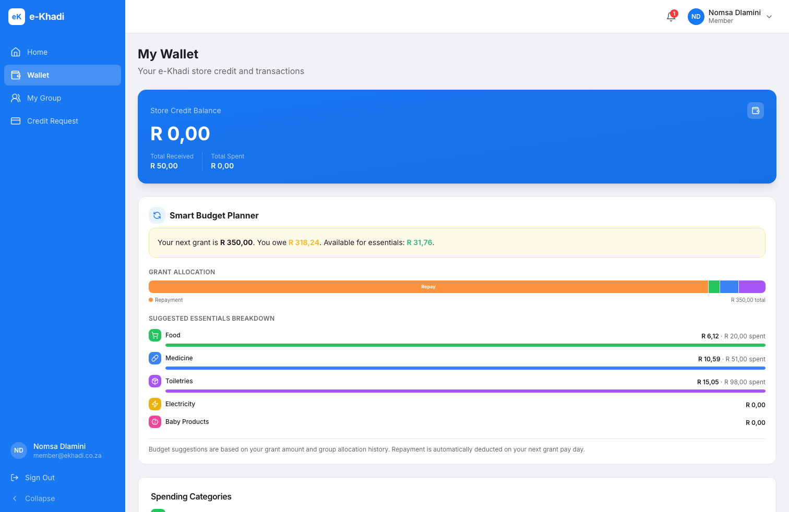
  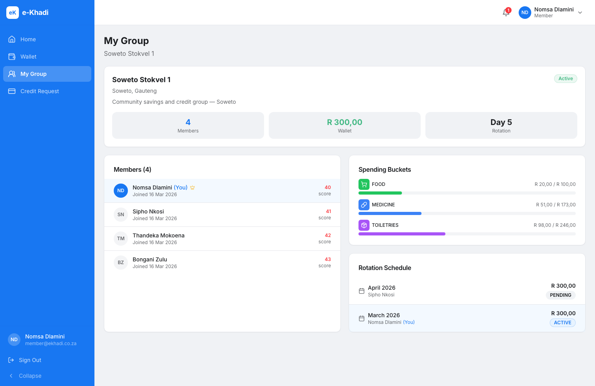
</p>
<p align="center">
  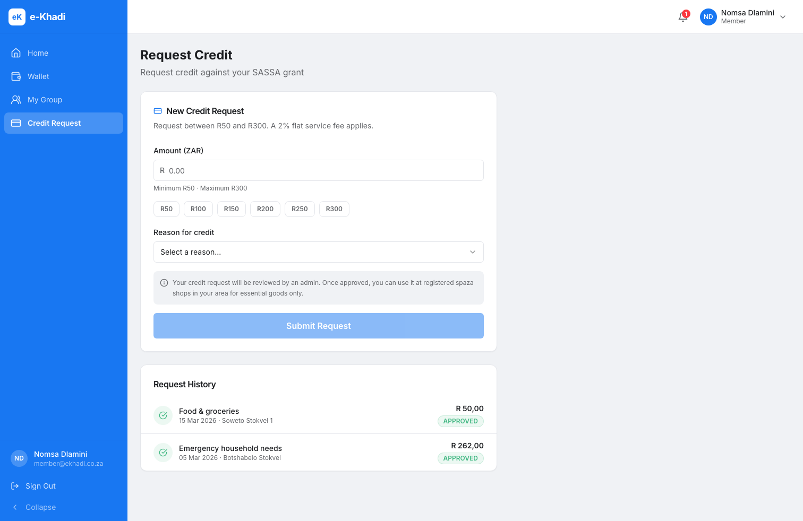
  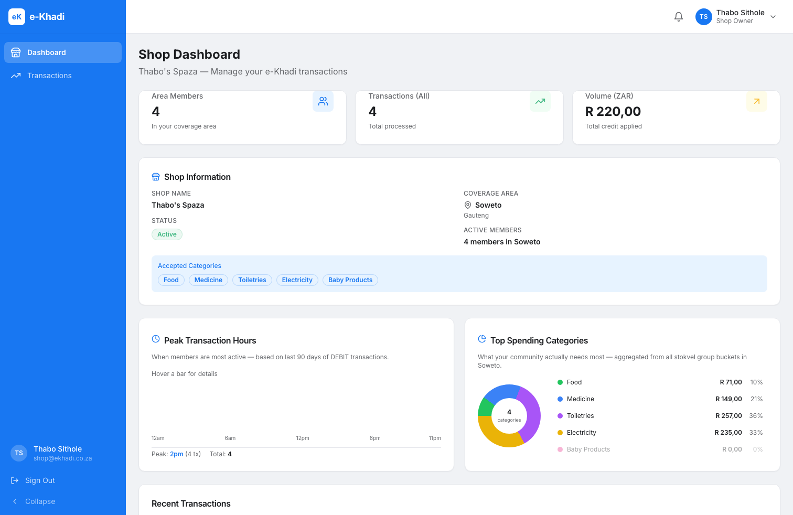
  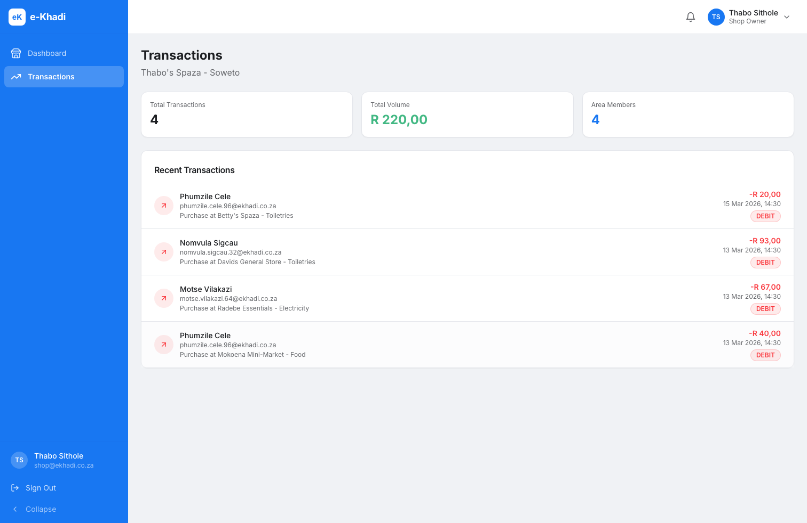
</p>
<p align="center">
  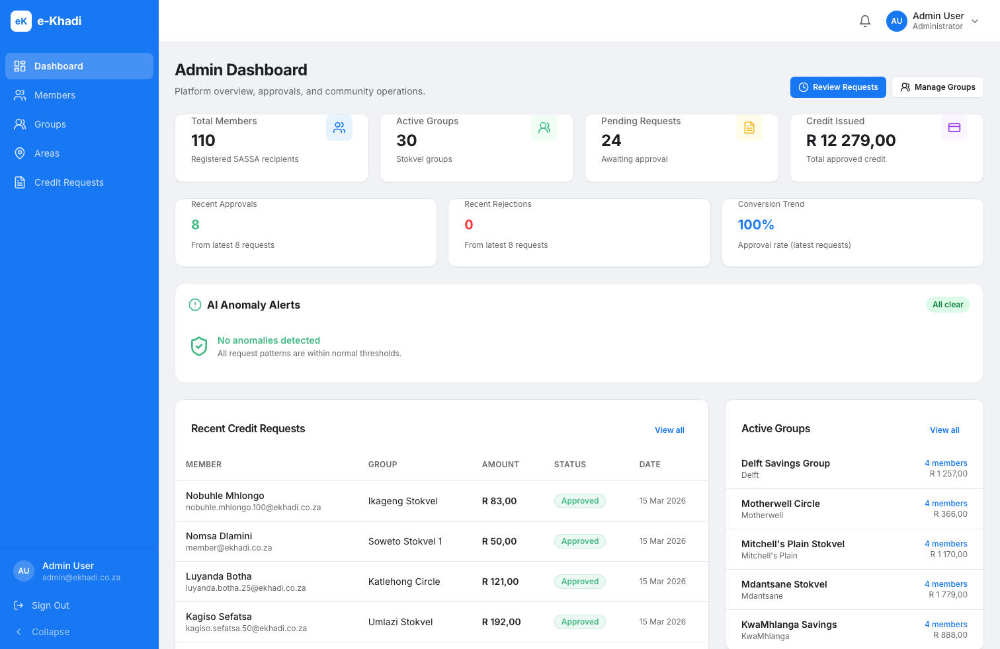
  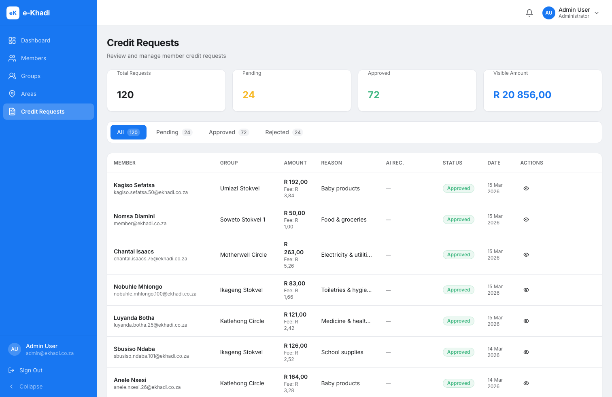
</p>

---

## Live Demo (Current Submission)

- **Live URL:** https://web-three-wine-92.vercel.app
- **GitHub:** https://github.com/faneleedison-ux/ekhadi-shopware-plugin

### Demo Credentials

| Role | Email | Password |
|---|---|---|
| Admin | `admin@ekhadi.co.za` | `Admin123!` |
| Member | `member@ekhadi.co.za` | `Member123!` |
| Shop | `shop@ekhadi.co.za` | `Shop123!` |

### Seeded Demo Dataset

| Data | Count |
|---|---|
| Provinces | 9 |
| Areas | 32 |
| Members | 110 |
| Shops | 92 |
| Groups | 30 |
| Group memberships | 120 |
| Credit requests | 120 |
| Transactions | 251 |
| Notifications | 96 |
| Repayments | 72 |
| Rotation cycles | 60 |

---

## The Problem

Many South Africans who receive SASSA grants (SRD R350, Old Age R1890, Disability R1890, Child Support R480) run out of funds mid-month. Their primary shopping outlets are local spaza shops. e-Khadi addresses this by:

- Letting communities form **stokvels** to pool grant money and support each other
- Providing **behaviour-based micro-credit** (R50–R300) for essential goods only
- Restricting credit to **spaza shops in the customer's registered area**
- Automatically repaying credit from the **next grant payment**

---

## Compatibility

- Next.js 14.x (App Router)
- Node.js 18+
- PostgreSQL (Supabase)
- Vercel deployment

### Legacy Compatibility (Shopware Plugin)

- Shopware 6.6.x
- PHP 8.1+
- MySQL 8.0+ / MariaDB 10.6+

---

## How to Run (Current Web App)

### Prerequisites

- Node.js 18+
- npm
- PostgreSQL database (Supabase recommended)

### Local Run

```bash
cd web
npm install
cp .env.example .env.local

# Fill DATABASE_URL, DIRECT_URL, NEXTAUTH_SECRET, NEXTAUTH_URL
npx prisma migrate dev
npm run dev
```

Open http://localhost:3000

### Database Migration

After cloning or pulling updates, apply all pending migrations:

```bash
cd web
npx prisma migrate dev --name <migration-name>
# e.g. after adding GENERAL bucket:
npx prisma migrate dev --name add_general_bucket
```

### Production Deploy (Vercel)

```bash
cd web
npx vercel --prod
```

Set these production environment variables in Vercel:

- `DATABASE_URL`
- `DIRECT_URL`
- `NEXTAUTH_SECRET`
- `NEXTAUTH_URL`
- `SEED_SECRET` (only if you need the protected seed route)

---

## How to Run (Legacy Shopware Plugin)

### Prerequisites

You need a running Shopware 6.6 installation. The fastest way is with Docker:

```bash
# 1. Clone Shopware 6 production template
git clone https://github.com/shopware/production.git shopware
cd shopware

# 2. Start Docker environment
docker compose up -d

# 3. Install Shopware
docker compose exec web bin/console system:install --create-database --basic-setup
```

### Install the e-Khadi Plugin

```bash
# Copy the plugin into Shopware's custom plugins directory
cp -r /path/to/e-Khadi/store-credit-shopware-6-solution25-main \
      shopware/custom/plugins/EKhadi

cd shopware

bin/console plugin:refresh
bin/console plugin:install EKhadi
bin/console plugin:activate EKhadi
bin/console database:migrate --all EKhadi
bin/console cache:clear
```

### Seed Demo Data (legacy plugin)

```bash
bin/console ekhadi:seed
bin/console ekhadi:seed --customers=500
bin/console ekhadi:seed --fresh
```

Demo password: `eKhadi@2025!` — customer number prefix: `EKH`

### Install Order States

```bash
bin/console store-credit:install-order-state
```

### Keep Background Jobs Running

```bash
bin/console scheduled-task:register
bin/console scheduled-task:run
bin/console messenger:consume
```

---

## Key Features

### Community Stokvel Groups

- Create groups with up to N members (configurable `maxMembers`)
- Members make monthly contributions into a shared wallet
- Wallet splits into typed spending buckets (food, medicine, toiletries, electricity, baby products)
- Monthly rotation determines who receives the group payout

### Essential-Goods-Only Credit

- Credit is only available for essential bucket types: `FOOD`, `MEDICINE`, `TOILETRIES`, `ELECTRICITY`, `BABY_PRODUCTS`
- `GENERAL` spending is tracked but ineligible for credit
- Checkout enforces bucket type — non-essential products are rejected

### Behaviour-Based Credit Scoring (No Credit Bureau)

Scoring uses 4 observable factors from e-Khadi data only:

| Factor | Points |
|---|---|
| Repayment ratio (repaid / approved) | 0–40 |
| Repayment speed | 0–20 |
| No outstanding debt | 0–20 |
| Grant cycle consistency | 0–20 |

Score → Credit Limit:

| Score | Limit |
|---|---|
| 80–100 | R300 |
| 60–79 | R200 |
| 40–59 | R150 |
| 20–39 | R100 |
| 0–19 | R50 |

Flat 2% service fee. No compound interest. Credit limit is **enforced at request time** — members cannot request above their current computed limit.

### Geographic Area Enforcement

- Each customer is assigned to an area (e.g., Soweto, Khayelitsha, Alexandra)
- Credit requests are only accepted for groups in the member's registered area
- Store credit can only be spent at spaza shops mapped to that same area (`POST /api/store-credit/spend`)
- Any purchase attempt from outside the member's area is blocked at the API level

### Grant-Aware Spend Monitoring

- Tracks amount spent since last grant payment
- Computes a shortfall risk score (0–100) based on daily spend rate
- Risk levels: Low (0–39), Medium (40–69), High (70–100)
- Flags customers likely to run short before next payment

### Automatic Repayment

- Admin triggers `POST /api/repayments/process` on each new grant cycle
- Finds all PENDING repayment schedules that are due
- Deducts principal + 2% flat fee from member's store credit wallet
- Marks schedule `PAID` and updates grant cycle `repaidAmount`
- If balance is insufficient, marks schedule `OVERDUE` and notifies the member
- Partial repayment not silently swallowed — overdue state is explicit

### AI Credit Recommendations (Admin)

- `GET /api/admin/ai-scores` returns a risk badge for every pending credit request
- Three levels: `HIGH_TRUST`, `MEDIUM_RISK`, `FLAG`
- Hard FLAG triggers: outstanding debt, ≥3 requests this month, zero repayment history across 2+ requests, large amount with low score
- Helps admins prioritise approvals without manual review of each case

---

## API Reference (Next.js Web App)

All endpoints require a valid session cookie (NextAuth JWT). Admin-only endpoints return `401` for unauthenticated and `403` for non-admin callers.

### Authentication

| Method | Path | Description |
|---|---|---|
| POST | `/api/auth/[...nextauth]` | Sign in / sign out (NextAuth) |
| POST | `/api/users` | Register new account (MEMBER or SHOP only) |

### Areas

| Method | Path | Auth | Description |
|---|---|---|---|
| GET | `/api/areas` | Any | List all areas with counts |
| POST | `/api/areas` | Admin | Create a new area |

### Groups

| Method | Path | Auth | Description |
|---|---|---|---|
| GET | `/api/groups` | Any | List groups (admin: all; member: own groups via `?my=true`) |
| POST | `/api/groups` | Admin | Create group + auto-create group wallet |
| GET | `/api/groups/[id]` | Member of group / Admin | Get group details with members, wallet, buckets, rotations |
| PATCH | `/api/groups/[id]` | Admin | Update group (validates `maxMembers` ≥ current count) |
| DELETE | `/api/groups/[id]` | Admin | Delete group |
| GET | `/api/groups/[id]/members` | Any | List group members |
| POST | `/api/groups/[id]/members` | Admin | Add member to group |

### Credit Requests

| Method | Path | Auth | Description |
|---|---|---|---|
| GET | `/api/credit-requests` | Any | List requests (admin: all; member: own) |
| POST | `/api/credit-requests` | Member | Submit request — enforces credit limit, area match, no duplicate pending |
| POST | `/api/credit-requests/[id]/approve` | Admin | Approve: disburse credit, create repayment schedule, notify member |
| POST | `/api/credit-requests/[id]/reject` | Admin | Reject and notify member |

### Store Credit & Spending

| Method | Path | Auth | Description |
|---|---|---|---|
| GET | `/api/store-credit` | Any | Get wallet balance + last 50 transactions |
| POST | `/api/store-credit` | Admin | Manual credit/debit with balance guard |
| POST | `/api/store-credit/spend` | Shop | Area-enforced purchase: validates member area = shop area before debit |

### Repayments

| Method | Path | Auth | Description |
|---|---|---|---|
| POST | `/api/repayments/process` | Admin | Process all due repayment schedules — deducts from wallets, marks PAID or OVERDUE |

### Grant Cycles

| Method | Path | Auth | Description |
|---|---|---|---|
| GET | `/api/grant-cycles` | Any | List grant cycles for current user (admin can query `?userId=`) |
| POST | `/api/grant-cycles` | Admin | Create or update grant cycle for a member |
| PATCH | `/api/grant-cycles/[id]` | Admin / Owner | Update cycle status (financial fields restricted to admin) |

### Notifications

| Method | Path | Auth | Description |
|---|---|---|---|
| GET | `/api/notifications` | Any | Get last 20 notifications + unread count |
| PATCH | `/api/notifications` | Any | Mark notification(s) as read (`?id=` for single, omit for all) |

### Users

| Method | Path | Auth | Description |
|---|---|---|---|
| GET | `/api/users` | Admin | List users, filterable by `?role=` |
| POST | `/api/users` | Public | Register (MEMBER or SHOP; ADMIN registration is disabled in UI) |

### Admin — AI Scores

| Method | Path | Auth | Description |
|---|---|---|---|
| GET | `/api/admin/ai-scores` | Admin | AI recommendation badge for every PENDING credit request |

---

## Legacy API Reference (Shopware Plugin)

> The endpoint catalog below is for the **legacy Shopware plugin** API in `src/Controller/Api`.

All legacy API endpoints require Bearer token authentication:
```
Authorization: Bearer <admin-api-token>
Content-Type: application/json
```

### Store Credit

| Method | Path | Description |
|---|---|---|
| POST | `/api/store-credit/add` | Add credit to a customer |
| POST | `/api/store-credit/deduct` | Deduct credit from a customer |
| GET | `/api/store-credit/balance` | Get customer credit balance |

### Groups & Members

| Method | Path | Description |
|---|---|---|
| POST | `/api/ekhadi/group` | Create a stokvel group |
| GET | `/api/ekhadi/groups` | List all active groups |
| GET | `/api/ekhadi/group/{groupId}` | Get group details |
| PATCH | `/api/ekhadi/group/{groupId}` | Update group |
| POST | `/api/ekhadi/group/{groupId}/member` | Add member to group |
| DELETE | `/api/ekhadi/member/{memberId}` | Remove member |
| GET | `/api/ekhadi/group/{groupId}/members` | List group members |

### Wallets & Buckets

| Method | Path | Description |
|---|---|---|
| GET | `/api/ekhadi/group/{groupId}/wallet` | Get wallet + buckets |
| POST | `/api/ekhadi/group/{groupId}/contribute` | Add contribution to wallet |
| POST | `/api/ekhadi/group/{groupId}/bucket` | Create/ensure a spending bucket |
| PATCH | `/api/ekhadi/bucket/{bucketId}/categories` | Update allowed product categories |

### Rotation Cycles

| Method | Path | Description |
|---|---|---|
| POST | `/api/ekhadi/group/{groupId}/rotation/schedule` | Schedule rotation for all members |
| POST | `/api/ekhadi/group/{groupId}/rotation/advance` | Advance to next cycle |
| POST | `/api/ekhadi/group/{groupId}/rotation/payout` | Pay out current beneficiary |
| GET | `/api/ekhadi/group/{groupId}/rotation/cycles` | List all cycles |
| GET | `/api/ekhadi/group/{groupId}/rotation/active` | Get active cycle |
| PATCH | `/api/ekhadi/rotation/cycle/{cycleId}/skip` | Skip a cycle |

### Credit Requests

| Method | Path | Description |
|---|---|---|
| POST | `/api/ekhadi/credit-request` | Submit a mid-month credit request |
| POST | `/api/ekhadi/credit-request/{requestId}/approve` | Approve a request |
| POST | `/api/ekhadi/credit-request/{requestId}/reject` | Reject a request |
| POST | `/api/ekhadi/credit-request/{requestId}/repay` | Mark as manually repaid |
| GET | `/api/ekhadi/group/{groupId}/credit-requests` | List group credit requests |
| GET | `/api/ekhadi/customer/{customerId}/credit-requests` | List customer credit requests |

### Areas & Customer Profiles

| Method | Path | Description |
|---|---|---|
| POST | `/api/ekhadi/area` | Create an area |
| GET | `/api/ekhadi/areas` | List all areas |
| GET | `/api/ekhadi/area/{areaId}` | Get area details |
| POST | `/api/ekhadi/area/{areaId}/shop` | Map a sales channel to an area |
| DELETE | `/api/ekhadi/area/{areaId}/shop/{salesChannelId}` | Remove shop from area |
| PUT | `/api/ekhadi/customer/{customerId}/profile` | Create/update customer profile |
| GET | `/api/ekhadi/customer/{customerId}/profile` | Get customer profile |
| POST | `/api/ekhadi/customer/{customerId}/credit-limit/recompute` | Recompute credit limit |

### Grant Cycles & Repayment

| Method | Path | Description |
|---|---|---|
| POST | `/api/ekhadi/customer/{customerId}/grant-payment` | Record grant arrival + auto-repay outstanding |
| GET | `/api/ekhadi/customer/{customerId}/spending-status` | Get spend velocity + risk score |
| GET | `/api/ekhadi/customer/{customerId}/credit-score` | Get behaviour-based credit score |
| GET | `/api/ekhadi/customer/{customerId}/repayment-schedule` | Get pending repayment schedule |
| GET | `/api/ekhadi/customer/{customerId}/grant-cycles` | Get grant cycle history |

---

## Example: Full Credit Request Flow

```bash
# 1. Member submits a R200 credit request (must be ≤ their score-based limit)
POST /api/credit-requests
{
  "groupId": "group-abc",
  "amount": 200,
  "reason": "Running low on groceries"
}
# -> 400 if amount > credit limit; 403 if member area ≠ group area

# 2. Admin reviews AI score badge
GET /api/admin/ai-scores
# -> [{ requestId: "...", level: "HIGH_TRUST", reason: "95% repayment rate · score 78" }]

# 3. Admin approves
POST /api/credit-requests/{id}/approve
# -> R200 added to member wallet; R204 repayment schedule created (due 1st of next month)

# 4. Member spends at their local spaza shop
POST /api/store-credit/spend
{
  "memberId": "user-xyz",
  "amount": 150,
  "description": "Groceries"
}
# -> 403 if shop area ≠ member area; 400 if insufficient balance

# 5. Next grant cycle — admin runs repayment processor
POST /api/repayments/process
# -> R204 deducted from wallet; schedule marked PAID; member notified
# -> If balance < R204: schedule marked OVERDUE; member notified
```

---

## Bucket Types

| Bucket | Eligible for Credit | Description |
|---|---|---|
| `FOOD` | Yes | Groceries and food items |
| `MEDICINE` | Yes | Medication and health products |
| `TOILETRIES` | Yes | Soap, hygiene products |
| `ELECTRICITY` | Yes | Prepaid electricity tokens |
| `BABY_PRODUCTS` | Yes | Nappies, formula, baby food |
| `GENERAL` | No | General shopping (credit blocked) |

---

## Database Schema (Next.js App)

| Model | Purpose |
|---|---|
| `users` | Accounts with roles: ADMIN, MEMBER, SHOP |
| `areas` | Geographic areas (9 provinces, 32 areas) |
| `shops` | Spaza shops mapped to areas |
| `customer_profiles` | SASSA ID, area assignment, credit score |
| `groups` | Stokvel groups |
| `group_members` | Group membership with role (ADMIN/MEMBER) |
| `group_wallets` | Shared wallet balance per group |
| `group_buckets` | Spending buckets per wallet |
| `rotation_cycles` | Monthly group payout rotation |
| `credit_requests` | Mid-month credit requests |
| `grant_cycles` | Monthly grant tracking (amount, spent, repaid) |
| `repayment_schedules` | Scheduled auto-repayments |
| `store_credits` | Personal store credit balance |
| `store_credit_history` | Transaction ledger |
| `notifications` | Event notifications per user |

---

## Legacy Database Tables (Shopware Plugin)

| Table | Purpose |
|---|---|
| `store_credit` | Personal store credit balance per customer |
| `store_credit_history` | All credit transactions |
| `ekhadi_area` | Geographic areas (9 provinces × 20 areas = 180) |
| `ekhadi_area_shop` | Maps spaza shops (sales channels) to areas |
| `ekhadi_customer_profile` | SASSA grant details, area assignment, credit limit |
| `ekhadi_group` | Stokvel groups |
| `ekhadi_group_member` | Group membership (role: admin/member) |
| `ekhadi_group_wallet` | Shared wallet balance per group |
| `ekhadi_group_bucket` | Spending buckets: food, medicine, toiletries, electricity, baby_products, general |
| `ekhadi_rotation_cycle` | Monthly rotation cycle — tracks whose turn to receive payout |
| `ekhadi_credit_request` | Mid-month credit requests with peer approval tracking |
| `ekhadi_grant_cycle` | Monthly grant cycle with spend velocity and risk score |
| `ekhadi_repayment_schedule` | Scheduled auto-repayments from next grant |

---

## Project Structure (Next.js App)

```
web/
├── app/
│   ├── (auth)/
│   │   ├── login/page.tsx
│   │   └── register/page.tsx        # MEMBER and SHOP registration only
│   ├── (dashboard)/
│   │   ├── admin/                   # Admin dashboard, areas, members, groups, credit requests
│   │   ├── member/                  # Member dashboard, group, credit request, wallet
│   │   └── shop/                    # Shop dashboard, transactions
│   └── api/
│       ├── areas/
│       ├── auth/[...nextauth]/
│       ├── admin/ai-scores/         # AI risk badges for pending requests
│       ├── credit-requests/
│       │   └── [id]/approve|reject/
│       ├── grant-cycles/[id]/
│       ├── groups/[id]/members/
│       ├── notifications/
│       ├── repayments/process/      # Auto-repayment processor (admin)
│       ├── store-credit/
│       │   └── spend/               # Area-enforced point-of-sale endpoint (shop)
│       ├── users/
│       └── seed/
├── components/
│   ├── admin/                       # AnomalyAlerts, CreditRiskHeatmap, AreasClient
│   ├── dashboard/                   # CreditBalanceCard, CreditHealthScoreCard, GrantProgressCard
│   ├── landing/                     # SouthAfricaLiveMap, ActivityFeedTicker, ImpactCounters
│   ├── member/                      # SmartBudgetPlanner
│   ├── shop/                        # CategorySpendDonut, PeakHoursChart
│   └── ui/                          # Radix UI components
├── lib/
│   ├── aiRecommendation.ts          # Recommendation engine (HIGH_TRUST / MEDIUM_RISK / FLAG)
│   ├── auth.ts                      # NextAuth config
│   ├── creditHealthScore.ts         # Scoring algorithm + credit limit computation
│   └── db.ts                        # Prisma client
├── prisma/
│   └── schema.prisma                # 16 models, PostgreSQL
└── middleware.ts                    # Role-based route protection
```

---

## Troubleshooting

**Plugin not appearing after install**
```bash
bin/console plugin:refresh
bin/console plugin:install EKhadi
bin/console cache:clear
```

**Migration errors (Shopware)**
```bash
bin/console database:migrate --all EKhadi
bin/console dbal:run-sql "SHOW TABLES LIKE 'ekhadi_%'"
```

**Migration errors (Next.js)**
```bash
cd web
npx prisma migrate dev
npx prisma generate
```

**Credit not applying at checkout**
- Verify the member has a `CustomerProfile` with `areaId` set
- Verify the shop is mapped to the same area as the member
- Confirm credit request was APPROVED and wallet balance is > 0
- Use `POST /api/store-credit/spend` — not the generic `/api/store-credit` POST — for shop purchases

**Repayments not processing**
- Call `POST /api/repayments/process` (admin only) after each grant cycle date
- Check `repayment_schedules` for OVERDUE records indicating insufficient balance at due date

**Seed command fails (legacy)**
- Ensure at least one sales channel, customer group, and ZA country exist in Shopware
- Run `bin/console ekhadi:seed --fresh` to reset and retry

---

## Changelog

### v3.1.0 — Security & Feature Hardening

- **Fixed:** Repayment fee floating-point precision — now `Math.round(amount * 1.02 * 100) / 100`
- **Fixed:** DEBIT operation now checks balance ≥ amount before decrementing (no more negative balances)
- **Fixed:** Credit requests now enforce the member's score-based credit limit (R50–R300 based on score), not just the absolute range
- **Fixed:** Grant cycle `spentAmount`/`repaidAmount` fields are now admin-only to prevent credit score manipulation
- **Fixed:** Member registration now returns a clear error if no area exists, instead of silently creating a profileless user
- **Fixed:** Group GET now returns 403 if the requesting user is not a member of the group
- **Fixed:** Group PATCH now validates that `maxMembers` cannot be set below the current member count
- **Fixed:** `status` and `role` query params validated against allowed enums before Prisma queries (no more raw 500 on bad input)
- **Fixed:** ADMIN role removed from public registration UI — admin accounts must be created directly
- **Added:** `POST /api/store-credit/spend` — shop-facing point-of-sale endpoint with geographic area enforcement
- **Added:** `POST /api/repayments/process` — admin endpoint that processes all due repayment schedules automatically
- **Added:** `GENERAL` bucket category added to `BucketCategory` enum in Prisma schema
- **Added:** Area restriction enforced at credit request time — member's area must match group's area

### v3.0.0 — Next.js Live Submission

- Added production-ready Next.js web app under `web/`
- Added role-based auth flows (Admin, Member, Shop)
- Added Supabase-backed production data store
- Added protected production seed route with realistic South African demo dataset
- Added live Vercel deployment and demo credentials
- Kept Shopware plugin implementation as legacy reference

### v2.0.0 — e-Khadi Platform (Legacy Shopware)

- Added 9 SA provinces × 20 geographic areas (180 total)
- Added stokvel group system: `ekhadi_group`, `ekhadi_group_member`
- Added group wallet + 6 spending bucket types: `ekhadi_group_wallet`, `ekhadi_group_bucket`
- Added monthly rotation cycles: `ekhadi_rotation_cycle`
- Added mid-month peer-approved credit requests: `ekhadi_credit_request`
- Added customer SASSA profiles with area assignment: `ekhadi_customer_profile`
- Added area-to-spaza-shop mapping: `ekhadi_area`, `ekhadi_area_shop`
- Added grant cycle tracking with spend velocity + shortfall risk score: `ekhadi_grant_cycle`
- Added automatic repayment scheduling from next grant: `ekhadi_repayment_schedule`
- Added behaviour-based credit scoring engine (no credit bureau required)
- Added checkout enforcement: essential goods only, area restriction, credit limit gate
- Added 6 new API controller groups (30+ endpoints)
- Added `bin/console ekhadi:seed` command with 1000 customers + full SA demo data
- Flat 2% service fee, no compound interest

### v1.0.5 — Store Credit (Original)

- Store credit management (add, deduct, balance)
- Partial usage across multiple orders
- Checkout integration
- Transaction history
- Refund-as-credit workflow
